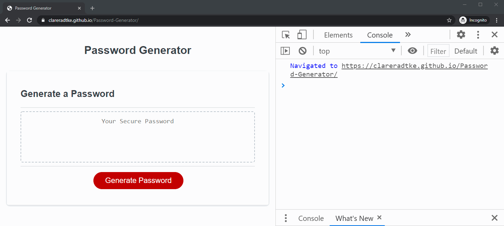

# Password-Generator
An application that generates random passwords based on criteria selected by the user.

[Password Generator](https://clareradtke.github.io/Password-Generator/)

Requirements for this application:

Functionality:
  [x] Generate Password button click presents a list of prompts for password criteria
  [x] Password criteria is selectable
  [] Each prompt selection is validated
  [x] At least one character type should be selected
  [x] Password is generated that matches the selected criteria
  [x] Generated password is displayed in an alert or written to the page

Password criteria:
  [x] Password length can be between 8 and 128 characters inclusive
  [x] Character options for the password include:
    [x] Lowercase
    [x] Uppercase
    [x] Numeric
    [x] Special characters

Additional requirements:
  [x] No errors produced in Chrome DevTools during use of application
  [x] Password generator resembles the mock-up provided by Monash Coding Bootcamp:
